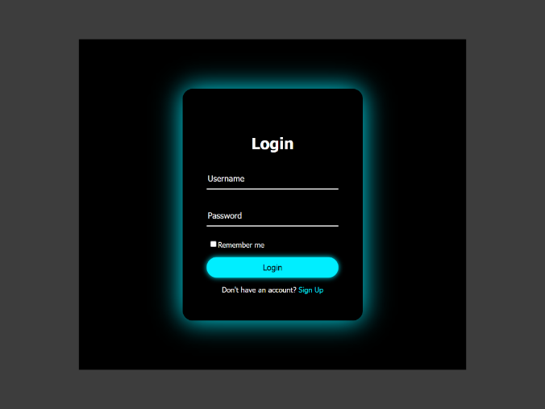

# 📝 Animated Login Form ( UI/UX )

>### click [_here_]() to see demo

### Overview
    This project is an animated login form designed with a focus on simplicity,
    usability, and clean visual feedback. It demonstrates how small animations and
    thoughtful UI choices can improve the user experience without adding unnecessary
    complexity.
###  Features
    - Smooth and subtle animations
    - Clean and minimal UI
    - Responsive layout for different screen sizes
    - Input focus and transition effects
### Technologies
    - HTML5 - semantic structure
    - CSS3 - layout, transitions, animations
    - JavaScript (ES6) - form handling and validation
### What I Learned
    - How to design user-friendly form interfaces
    - Using CSS animations to enhance user interaction
    - Managing form logic with JavaScript
    - Structuring a small frontend project in a clean way
### Purpose
    The purpose of this project is to :
    - Practice frontend fundamentals
    - Improve UI/UX design skills
    - Learn how animations enhance user interaction
### Next Step
    - Add Validation ( Regex )
    - Add Error message
    - Add Dark/Light mode
    - Add Loading animation
This project will be improved step by step as I continue learnig.